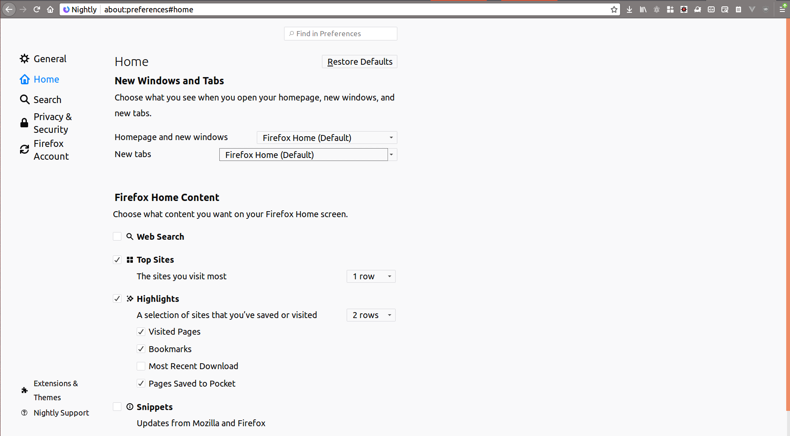
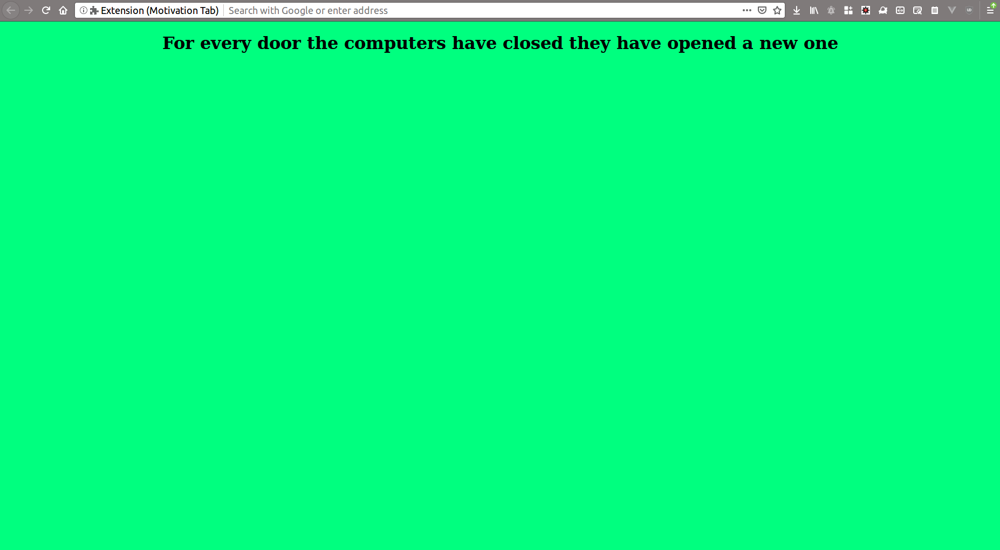

# Experiment 1: Building our Motivational Tab

We got to know what is meant by WebExtension and how to install WebExtension from the source code available in our system. Those leasons are very important to us, as we move forward with our development, we will be always using them.

Our Approach is learn the basic code, try them out with little modification and run them in our system, try out the execrise and share about this learning in social medium of community benefit.

## Problem statement and Solution

*Problem Statement*

We have to open different web pages each and every day. Sometime we will be bored to do them. At that time, we may feel to get a cup of coffee. For sure its not possible to count the number of copies we had. Having too much of coffee or other caffeine products is injurious to health. 

*Solution*

So the very first solution is to make sure we are not bored, and we are motivated when we open a new tab. We can be motivated by seeing strong quotes by our favorite personality or a our family pictures whenever we open a new tab.

**What is relationship with WebExtension???**

Whenever you are opening a new tab, it means we are calling some internal API to open the tab. Each and every action we do is an API, some of them are exposed via WebExtension API. So by default if you check in your browser you will understand you have options to change what should be shown when a new tab is opened. A screenshot from Firefox is shown below, check under the heading *New Windows and Tabs*



**How we can capture this**

We need not worry much. It is easy to capture when a new tab is opened. And also it is easy to open our preferred page whenever new tab or window is opened. In this section we will be seeing how to open our own page with some random pre defined quotes using   *chrome_url_overrides* WebExtension API.

## Building Blocks of Our Motivation Tab WebExtension

### Writing manifest.json

For every program we will start by writing the manifest.json, as it will be giving us the clear view what we are going to do and what are all the components like permission, background script, resources and so on, we are going to have.

```json
{
"manifest_version": 2,
"name" : "Motivation Tab",
"description" : "Shows Random Quotes ",
  "version": "1.0",
  "chrome_url_overrides" : {
    "newtab": "my-new-tab.html"
  }
}
```

The above is our manifest.json required for this program. The very important keys which we have to define for the manifest json are as follows

- name
- description
- manifest_version is always 2 (till Mozilla changes)
- version  is the version of this addon, and it should be incremental.

Additionally for this particular Add-on (WebExtension) we are going to use *chrome_url_overrides*

#### What is chrome_url_overrides ??

We can remember it as URL Overrider, means it will be over riding the default with the value we give in the extension. In our example we are saying to  over ride the **newtab** , so whenever there is a new tab created if our extension is installed then, our extension will be over riding the other pages and will show the page which we have defined.

So our definition will be like below, 

```json
"chrome_url_overrides" : {
    "newtab": "my-new-tab.html"
  }
```

In the chrome_url_overrides defintion, the value of *newtab* is "my-new-tab.html", which is defined by us. We can define what pages we want.

### Our Basic HTML Page

Our next step is to write the HTML page.

```html
<!DOCTYPE html>
  <html>
    <head>
      <meta charset="utf-8"/>
      <title>The best Motivation Tab</title>
    </head>
    <body>
      <h1 id="quote" style="text-align: center"></h1>
      <script type="text/javascript" src="script.js"></script>
    </body>
  </html>
```

Our HTML page is very minimal, we will be having only **one heading element** with unique id for that, and we will be including the javascript file.

### Our Javascript file,

Our JS file will be having random quotes and the colors for the background.

```javascript
let random_quote = [
 "quote1", "quote2", "quote3"
];

let color_hex = ['#778899','#B0C4DE','#E6E6FA','#90EE90','#00FF7F'];
function getRandomQuote() {
  // Generate Random Number for Quote
  var quote_random_num = Math.floor((Math.random() * random_quote.length)); 
  // Set the content in the div
  document.getElementById("quote").innerText  = random_quote[quote_random_num];
  // Get Random Number for color
  var random_col_num = Math.floor((Math.random() * color_hex.length));
  // Update the background with color
  document.body.style.backgroundColor = color_hex[random_col_num];

}

// Call the method getRandomQuote when this js loads
getRandomQuote();
```

Thats it, our extension (WebExtension or Add-on) is ready, once we do temporary install we can experience it. When we open a new tab our page by default will look like below.



## Exercise

Make sure to visit Mozilla Developer Network (MDN) [1] to learn more about the above API.

So try out this API in your get started program. Your task is simple you have to load beautiful images whenever a user opens a new tab. We have already done opening Beautiful Quotes, instead of words you make it as image. Remembers visuals have more power compared to basic text words.

Optional: It will be great if you can share your code or blog about this learning in twitter. Our Mozilla Webextension twitter handle is (@MozWebExt) and make sure you use hashtag #WebExtLearn when you are tweeting about this learning. 

## References

- [1] https://mzl.la/2PBUToi
- [2] https://twitter.com/MozWebExt 