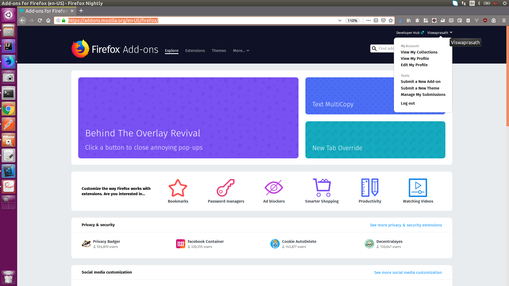
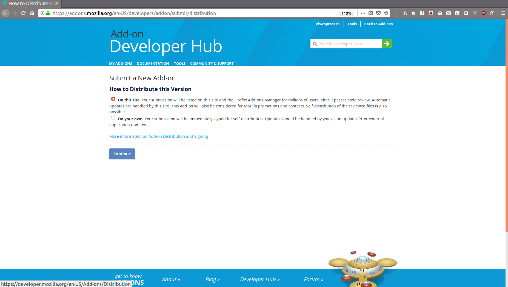
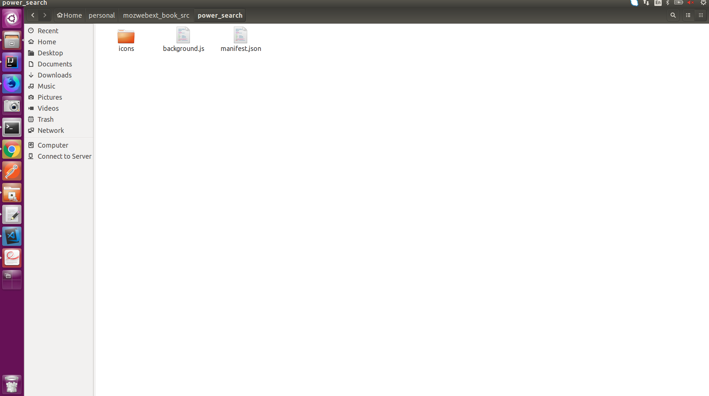
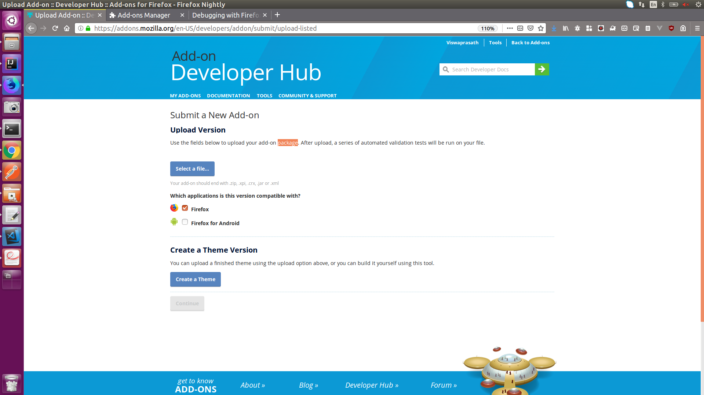
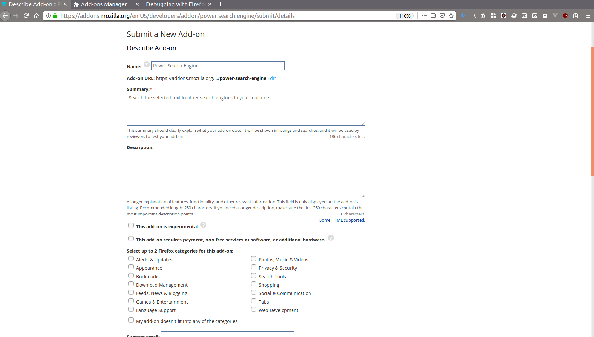
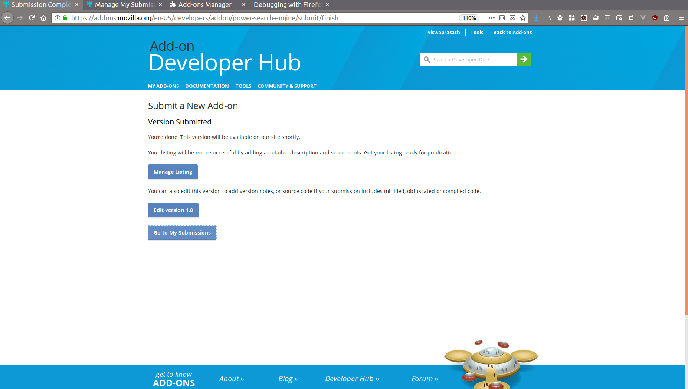

# Publishing our First WebExtension

So we have started learning WebExtensions and our really learning excitement and lot of fun comes only when we start publishing our work. Publishing the developed Webextension in Firefox Add-ons store is very easy and its also free, there are some other browser specific stores which charges us. No need to worry about it.

- Step 1: Visit https://addons.mozilla.org/en-US/firefox/  (AMO website)
- Step 2: Click on Submit a New Add-on from the right top corner.

- Step 3: You will be landing to https://addons.mozilla.org/en-US/developers/addon/submit/distribution  webpage.

In this publish page we can now select **On this site** option. And click the next button. So before doing anything in AMO  website, we should prepare our zip files of our extension.

- We have to goto the directory where all our contents are present.
- Select every content in that directory.
- Compress as zip.
- So in our case **power_search.zip** is ready

Now we should be in uploader page.

In this page we have to select the zip file which we have created just now.
Once the upload is done, you will be seeing the continue button, click that.

The next page will ask **Do You Need to Submit Source Code?**, this is asked for developers who try using the JS minifier, template engine creator. As we are just getting started mostly our answer will be **no** for this. 

The next page is you will be shown with the pre-populated values from your manifest.json

We can give the detailed description in this page. We have to select the categories, support email address and the license type of our add-ons. Then click on submit version.

You will be redirected to **version submitted** page

If you click on **Manage Listing** button, you will be redirected to the page where you can edit the values for your extension.

## Congrats

You have published your first WebExtension to AMO. With this, you can proudly announce you are Web extension developer. It's time for you to start sharing your extension development knowledge to others and make the community bigger and stronger.

## Exercise

Publish one of the extension which you made during this journey. And  share your code or blog about this learning on twitter or any social. Our Mozilla Web extension twitter handle is (@MozWebExt) and make sure you use hashtag #WebExtLearn when you are tweeting about publishing your Extension.
