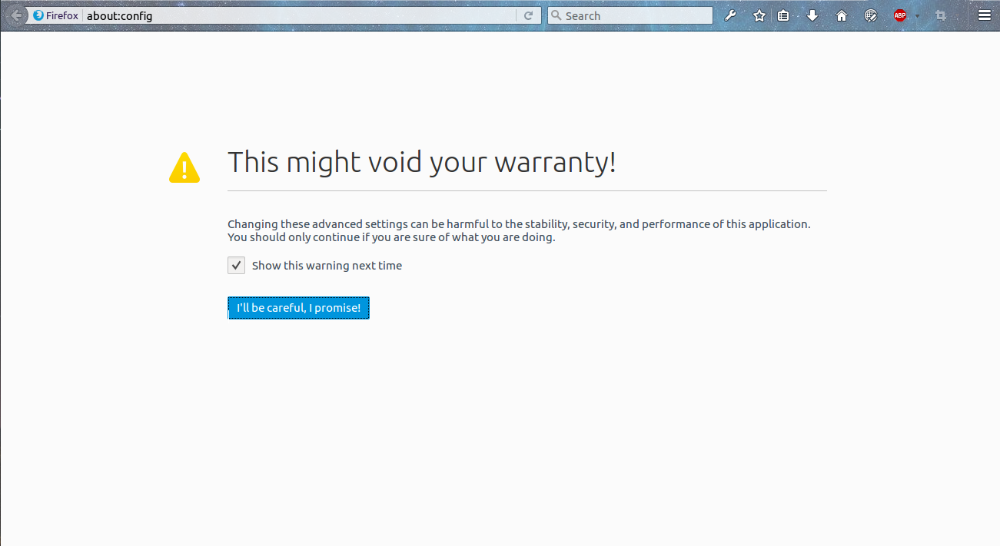
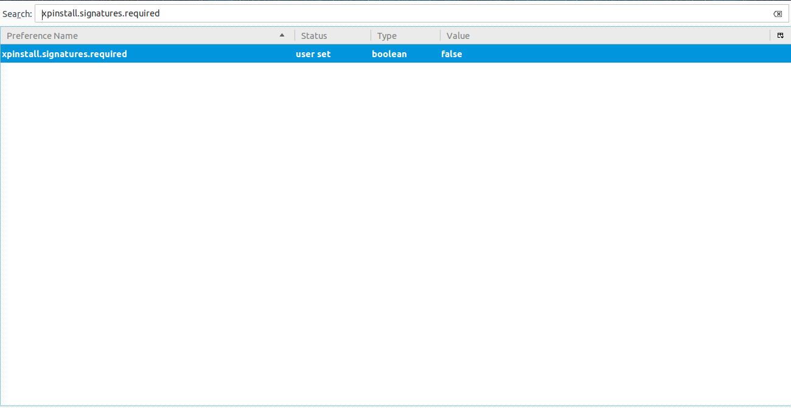

# Getting Started with Mozilla Webextensions

During 2015  Firefox team has made an exciting very big announcement to Firefox add-ons, they have brought a new extension API's called WebExtension [1].  This update has a lot of exciting announcements for developers. 

1. The review process will become faster
2. Development is easier, and the Addons will be compatible with Chrome and Opera.

You can find the whole information regarding this update in Add-ons Blog [2]

The next step is to download the Firefox Browser and install them. You can either go for developer Edition [3] or Nightly [4]

So as of now, Firefox Will allow only the add-ons which are signed when you start the browser. So for development purpose, we have to change the settings.

1. Open the browser
2. in the URL bar type about:config

  

  

3. In the search bar of that page type xpinstall.signatures.required, you will see the image as like below. By default, it will be true

  

4. You can double click on it or else right click and select toggle. So it will be set to false

## Why Web Extensions

One of the Main reason, to get started with Web Extensions is easier to develop. Previously I have tried developing some Chrome Extensions during my free time, so since the same thing is used here, it will be very easier for me to get started and develop well. So I write once for Firefox Add-ons and it will support multiple platforms.

Very excited for this new journey of learning.

## References

- [1] https://wiki.mozilla.org/WebExtensions
- [2] https://blog.mozilla.org/addons/2015/08/21/the-future-of-developing-firefox-add-ons/
- [3] https://www.mozilla.org/en-US/firefox/developer/
- [4] https://nightly.mozilla.org/
