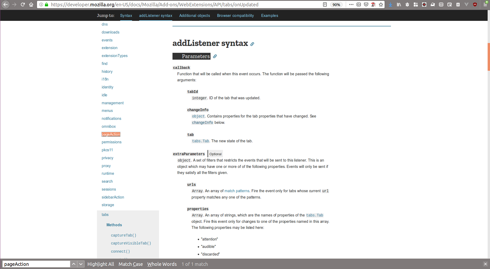
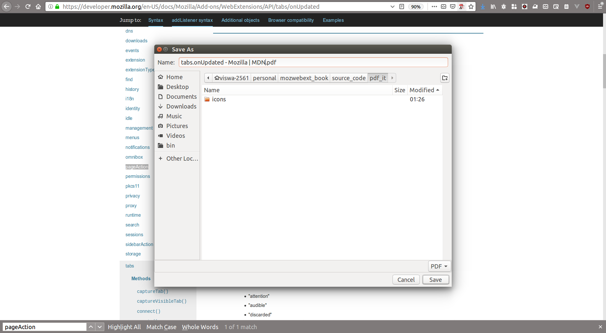

# Experiment 4: Building PDF WebPage Extension

So we were learning about fetching the tabs Closing them one by one. There are times in our life where we need to do something later. Yes, we need to do a lot of things later. In this chapter we will be learning how to save so we can check it later. We learned more about browserAction icon previously now we will be learning opposite to it (not exactly just for fun) PageAction icon, we are seeing it in a lot of pages think of closing tab button, bookmark button, what they are doing ? what is their scope?

## Problem Statement and Solution

*Problem Statement*

We read each and everyday lot of articles. Think of pages you read in Wikipedia, sometimes you will dive deep into it and wanted to spend the large amount on that article but you might have closed it and never opened again. This is the saddest thing can happen when you see that article again and start reading.

*Solution*

We have very simple solutions for this, we can save it to the Pocket app (https://getpocket.com/), or you can save the whole page by selecting all the text copying it and saving it in the text file which is the seriously boring thing you can do. One better option is to make the pages as PDF when we have a readable view.

**How we can capture this**

We have very rich tabs WebExtension API which with which we can know whether that particular tab is in readable mode or not, we can know when there is a change in the tab, with the simple click we can make the page as PDF.

## Building Blocks of PDF WebPage Extension

We will get straight to the API we will be using. Our flow is simple, whenever there is a change in tab we will be checking whether current tab has a readable formatted page, if it is available we will be enabling the pageAction icon, whenever there is a click in pageAction icon we will be saving it as PDF in our system.

### Capturing change in tab

Changing the tab means activating from one tab to another tab. In Tabs API we are having the method to capture this.

```javascript
  browser.tabs.onActivated.addListener(listen_to_tab_change);
  
  function listen_to_tab_change(activeTabInfo){
    //do Something
  }
```

So whenever there is a change in the tab, if we want to capture it we will be having an activeListener method. In this method, we will be doing whatever we want.

Similarly, we have to check whenever there is an update on the same tab(current tab itself). Like if the current page is www.google.com and now we moves to Wikipedia site where we may some downloaded content, so we have to capture that also.

```javascript
browser.tabs.onUpdated.addListener(listen_to_tab_update);
 function listen_to_tab_update(activeTabInfo){
    //do Something
  }
```

Finally we have to listen when there is a new tab create.

```javascript
browser.tabs.onCreated.addListener(listen_to_tab_create);
function listen_to_tab_create(activeTabInfo){
    //do Something
  }
```

These above 3 are the cases we need to capture. In all the 3 cases the following will be the same. We will first check whether the tab updated or created or changed to is in ReadMode format.

### Checking is current Tab reabable format

So the tab object will be having a lot of details like id, index, title, URL and so on. One of the value is **isArticle**

If the value of isArticle is true, then it means we have readable format (ReadMode is available) tab. In that case, we can download as PDF.

### Showing the pageAction icon

So we came to know the current page can be in reading mode, which means we can have the option to download the page as PDF. At this stage, we may need to have user intervention. Remember we learned about browser Action icon during **Building our Tabs Closer**, similar we have pageAction icon (which we can consider limited edition of browser Action icon).

The major difference between the browserAction icon and pageAction icon is the scope of availability. the browserAction icon is available outside the address bar icon which means it is not limited to that particular tab alone while the pageAction icon is inside the address bar which means it is very specifically limited only to that tab alone.

So in our case, we will be showing the pageAction icon whenever the current page which we are viewing is having a Reader mode.

### Downloading the page

The only final step now is we have to download (save) the page as PDF. This is just one method call, all parameters are optional so we need not pass anything to just save without any modification.

```javascript
browser.tabs.saveAsPDF({});
```

So our next step is to start assembling all the API's into single WebExtension.

### Assembling parts of PDF-IT Extension

#### manifest.json look

Most parts of our manifest.json look very similar. The only addition to their permission is **activeTab**. And we are adding a new part of json **page_action** which is similar to browser action.

```javascript
{
"manifest_version": 2,
"name" :"Save as PDF",
"description" : "Saves pages as pdf",

"homepage_url": "http://iamvp7.github.io/",
  "version": "1.0",

"icons": {
    "48": "icons/page-48.png",
    "32": "icons/page-32.png"
  },
  "background": {
    "scripts": ["background.js"]
  },
  "permissions" : ["tabs" , "activeTab"],
  "page_action": {
    "default_icon": "icons/page-32.png",
    "default_title": "Download as PDF"
  }
}
```

#### Adding tab state changes listeners

Our next step is adding the listeners when there is an update in the tab, creation in a new tab, activation in the tab.

```javascript
browser.tabs.onUpdated.addListener(listen_tab_update);

browser.tabs.onActivated.addListener(listen_when_tab_activated);

browser.tabs.onCreated.addListener(listen_when_tab_create);
```

After listen we will have the same set of actions, but different listeners have the different structure of call back functions. So we need 3 methods.

#### Adding Implementation for listeners

So we will be adding the Listener for each and every type we have mentioned. In some cases we will be getting the current tab id directly, in some cases, we will be fetching them.

##### Adding onUpdate Listener

When there is an update in the current tab we will be listening to the change in this method for this extension.

```javascript
function listen_tab_update(tabId, changeInfo, tab) {
  getCurrentTabDetails();
  }
function getCurrentTabDetails(){
    var querying = browser.tabs.query({currentWindow: true, active: true});
    querying.then(getInfoForTab, onError);
  }

  function getInfoForTab(tabs) {
    if (tabs.length > 0 && tabs[0] != null && tabs[0].isArticle) {
      browser.pageAction.show(tabs[0].id);
    }
  }

  function onError(error) {
    console.log(`Error: ${error}`);
  }
```

The callback in this function will be having 3 parameters tabId in which the update action has taken place, change info option and the current state of the tab object. Among the all 3 we have got we will be needing the **tabId** alone, so for the current tab we will be showing the **pageAction icon**.

But we also need the details like whether the current tab is in a readable format. So first in **getCurrentTabDetails** we will be querying the active tab from the currently active window, we will be getting the list of tab array. From that tab array, we will iterate each object and will be getting the first one alone.


##### Adding onActivated Listener

So we have to add a listener method for tab activated. In this, we will be receiving only one parameter (activeInfo Object), where we won't get the tab details. So for this, we will be querying the current tab and from that, we will be receiving the tabId. Similar to what we have done during close tabs we will do here.

```javascript
  function listen_when_tab_activated (activeInfo) {
    getCurrentTabDetails();
  }
```
Here also similarly we will be call the **getCurrentTabDetails**

##### Adding onCreated Listener

So our final listener method is required when we are creating the new tab.

```javascript
  function listen_when_tab_create(tab){
    getCurrentTabDetails();
  }
```

Here also similarly we will be called the **getCurrentTabDetails**

The only thing which we are doing in each of the listener methods is to show the **pageAction** icon. As discussed previously, when the user clicks we will be saving it as PDF

#### Adding pageAction listener

So when the pageAction icon  is clicked, we have to do something. So we will be listening from backgroun.js and will wait for pageAction click.

```javascript
  browser.pageAction.onClicked.addListener(doPageActClickProc);
```

#### Save as PDF

So our final step once the pageAction icon click is just to save the current readable page as PDF. 

```javascript
  function doPageActClickProc(){
    // browser.tabs.toggleReaderMode();
    browser.tabs.saveAsPDF({});
  }
```

So when you are running your extension you will be seeing the icon near the bookmark icon inside the address bar. Like below



When we click on the icon we will be getting the pop-up for saving the file as pdf.



## Exercise

To learn More about below list of API, visit MDN link given below.

- `onUpdate` [1]
- `onActivate` [2]
- `onCreate` [3]
- `pageAction` [4]

Your simple task is to create a small social share button. So when the user clicks on the pageAction icon he should have options to share it to various social media.

Optional: It will be great if you can share your code or blog about this learning on Twitter. Make sure you use hashtag #WebExtLearn when you are tweeting about this activity.

## References

- [1] https://mzl.la/2OngPCk
- [2] https://mzl.la/2JDMsqq
- [3] https://mzl.la/2EYAnx9
- [4] https://mzl.la/2SHe02h