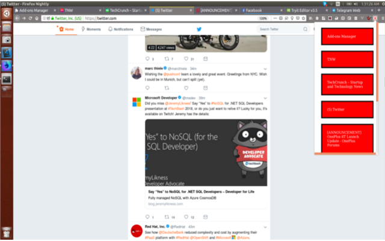

# Building our Tabs Closer

We have seen previosly how to search using different search engine available in our browsers. It should interesting and easy one right ? Hope the execrise you tried might have left to finding the URL of different search engines and what are all the extra information they are sending as request params.

## Problem statement and Solution

*Problem Statement*

Now when we are star surfing internet, we end up opening atleast 10-20 tabs, because each and every page have some many hyperlinks which we love to learn and come back, but in reality hyperlinks in that pages leads to different page again there are so many hyper links. In such a case if you are in college or office closing the social media websites (some of us do, we dont love to show it to our boss) will be difficult have to close so many tabs after finding them.

*Solution*

The simple solution will be to have the list of social websites we visit and with one click, we can close all the tabs. The another solution will be to list all the tabs we have close from an pop-up one by one; this will work great when we are having more than 20 tabs.

**How we can capture this**

Breaking according to two solutions.

*Showing the pre-defined Social Network sites*

In this type, we will be pre-defining the one social media website which we visit often. We will be having the icon to close that particular social media website alone. On clicking the icon, all the tabs having that social media website URL should be closed.

*Fetching all opened URL*

Another approach will be fetching all the opened websites, listing them one by one and when we click on close button we can close them. Just incase we need to visit them we will have another button to visit the particular tab.

In this execrise we will be learning the following list of API

- Tabs.query (To fetch all tabs)
- Tabs.remove (Close)
- Tabs.move (To display the tab clicked)
- Browser Action Icon
- Browser Action pop-up

## Building Blocks of Our Social Media Tab Closer

First we will take a look at the API we will be using in this Execrise.

### Getting started with Basics of API of Social Tab Closer

#### Starting the Closing Operation

First step is we need to click on the browserAction icon. As the name suggest browserAction icon will have to scope throughtout the browser and it is not specific to any one particular tab. So whenever we click on it irrespective of tabs we can do the procedure. Once we have click the icon we need to capture the click action.

We have browserAction API for capturing this. *browserAction.onClicked* will be used to listen to click action on that icon.

```javascript
browser.browserAction.onClicked.addListener(action_jump_function_name);
```

#### Fetching the twitter tabs

In this case we will be knowing the website URL of Twitter, it is nothing but https://twitter.com/ . So our first step will be to get all the tabs where Twitter is loaded. Our WebExtension *tabs.query* have lot of combination to get(or fetch) the tabs loaded, in this case we are going to fetch based on **URL**

```javascript
browser.tabs.query({url: "*://*.twitter.com/*"});
```

Some times we wont know whether its *http* or *https* so we are using the regex (Regular Expression) *://* before twitter.com and also we may be having anything loaded so we have /* at the end of .com

#### Close the tabs

Once we have got the tabs (or single tab) we need to close them. We have to get the tabid from the tab object we got, based on that only we will be closing the tabs.

```javascript
var removing = browser.tabs.remove([tab_id1, tab_id10, tab_id15]);
```

### Assembling parts of our Extension

So now our task is to just write all the above code in manifest.json and background script file. Mos to fhte things are coverd.

#### Writing manifest.json

```javascript
{
  "manifest_version": 2,
  "name" : "Social Tab Closer",
  "description" : "Close the pre-defined Social Media Tabs",
    "version": "1.0",
  "icons": {
      "96": "icons/icon-96.png"
    },
    "permissions" : [
      "tabs"
    ],
  "background": {
      "scripts": ["background.js"]
    },
    "browser_action": {
      "default_icon": {
        "96": "icons/icon-96.png"
      }
    }
  }
```

Here changes we made will be getting the tabs permission. And also we have to define the brower_action icon alone. We wont make any other drastic changes compared to previous manifest.json.

#### Writing our background.js

We will be splitting the background javascript into parts.

- Listen to browser Action Icon
- Fetch the twitter tabs.
- close the tabs.

#### Listen to browser Action Icon

```javascript
browser.browserAction.onClicked.addListener(icon_clicked);
```

Our first step will be to listen whenever our browserAction icon is clicked. Once it is clicked we have to pass the control to the method (icon_clicked) which we have defined.

#### Fetch the twitter tabs

```javascript
function icon_clicked(tab){
  var querying_tabs = browser.tabs.query({url: "*://*.twitter.com/*"});
  querying_tabs.then(close_tabs);
}
```

Our next step will be to fetch(query) the tabs where twitter.com is loaded, so we will be using the regex which we discussed before and fetch the tabs with the url pattern.

#### Close the tabs

```javascript
function close_tabs(twitter_tabs){
var array_of_twitter_tabid = [];
  for(let single_twitter_tab of twitter_tabs){
    array_of_twitter_tabid.push(single_twitter_tab.id);
  }

  browser.tabs.remove(array_of_twitter_tabid);
}
```

Our Next step is to get the tab id with the tabs we have fetched. We are first iterating each and every tab object which we are getting in tab array as a result of query using URL. Then while iterating we are getting the **id** and inserting in the array. After we finish the iteration we are just using the close (remove) API and closing the tabs.

## Building Blocks of All Tabs Closer

We are going to almost use same set of API which we used for our social tab close. Here we will additionaly have a very small change in manifest.json.

### Getting started with Basics of API of All Tab Closer

#### Adding popup html page

Previously we have mentioned the browserAction icon and just left. Now in manifest.json we are additionally going to add the html page which has to be shown when browserAction icon is clicked and also the title which has to be shown when we move our mouse above browserAction icon.

**Note:We can either Click on the browser Action icon or we can show the HTML page**


#### Fetching the all the tabs

Previously we have passed the url and fetched the tabs where twitter.com is loded. Now simply we dont need to pass anything so we will be getting all the tabs.

```javascript
browser.tabs.query();
```

#### Close the single tab

We are going to close the tabs one by one, so instead of passing the array of tabIDs we can pass only one tabID also.

```javascript
var removing = browser.tabs.remove(tab_id1);
```

### Assembling parts of our All Closer Extension

Lets start with manifest.json, for now will share the whole content, in future we can slowly start sharing only the parts which are having difference.

#### manifest.json look

```javascript
{
  "manifest_version": 2,
  "name" : "All Tab Closer",
  "description" : "Close All Tabs",
    "version": "1.0",
  "icons": {
      "96": "icons/icon-96.png"
    },
    "permissions" : [
    "tabs"
    ],
  "background": {
      "scripts": ["popup/script.js"]
    },
    "browser_action": {
      "default_icon": {
        "96": "icons/icon-96.png"
      },
      "default_title": "List all tabs",
    "default_popup": "popup/tabs_list.html"
    }
  }
```

So our change will be mostly in the **browser_action** part. We have additionally added two more keys for it. Most of the parts remains quite familier and its based on this Add-on.


#### Building our tiny HTML page.

We need a HTML page which will be acting as a popup when we are going to click on **browserAction** icon. So we need to design very small page.

```html
<!DOCTYPE html>
<html>
<head>
    <meta charset="utf-8"/>
    <title>List of Tabs</title>
</head>
<style>
    .single_div {
        background-color: lightgrey;
        border: 5px solid rgb(11, 12, 11);
        padding: 25px;
        margin: 25px;
    }
    </style>
<body>
  <div id="tabs_list" style="width: 300px">
    </div>
  <script type="text/javascript" src="script.js"></script>
</body>
</html>
```

Our HTML page is having some css for design and most important part is the div with id *tabs_list*, we will be creating all our tab details and will show here.



And we have also included the Javascript file at the end. This same JS file will be acting as background script file.

#### Included JS and Background JS

Our first action once the javascript file is loaded is to collect all the tabs which are opened. We are processing this action in **startFetchingTabs** method

```javascript
startFetchingTabs();

// Fetch all the tabs
function startFetchingTabs() {
  var querying = browser.tabs.query({});
  querying.then(create_list_tabs, onError);
}
```

After we have collected the tabs our action will be to list them in the popup browserAction page. 
So we are itearting tab object one by one. tab object will be having the details like tabID, tabTitle and tabURL. We as of now need tabID and tabTitle.

First we will be deleted all the already listed tabs in the pop-up HTML page, then after that we are creating the div one by one for all the tabs opened.

```javascript
function create_list_tabs(fetched_tabs) {
  // delete already existing child nodes.
  if (document.getElementById("tabs_list").childNodes.length > 0) {
    var myNode = document.getElementById("tabs_list");
    while (myNode.firstChild) {
      myNode.removeChild(myNode.firstChild);
    }
  }

  // Create new child nodes.
  for (let single_tab of fetched_tabs) {

    var created_div = document.createElement("div");
    created_div.style.width = "200px";
    created_div.style.background = "red";
    created_div.style.color = "white";
    created_div.innerHTML = single_tab.title;
    created_div.id = single_tab.id;
    created_div.className = "single_div";
    created_div.addEventListener("click", function () {
      close_tab(single_tab.id);
    }, false);

    document.getElementById("tabs_list").appendChild(created_div);
  }
}
```

We have created the div in such a manner, the tab Title will be displayed to the user. And each and every title is associated with tabID. When we click on any part of the div, the tab ID is passed to **close_tab** method and there we will start the process of closing the tab.

```javascript
// Close the tab and recreate the popup html
function close_tab(tab_id_to_close) {
  browser.tabs.remove(tab_id_to_close);
  startFetchingTabs();
}
```

As discussed before, once the title is clicked, the respective id is passed and we will be closing the tab with that particular ID after that we will again be creating the popup browserAction HTML page.


## Exercise

Make sure to visit Mozilla Developer Network (MDN) to learn more about the above API.

- Close API [1]
- Query API [2]
- Capture Tab [3]
- Reload Tab [4]
- Browser Action [5]

There are lot of things related to tabs API to be explored. We have as of now have used the title and showed the list of tabs. But sometimes Title alone wont be enough, we have an API to capture the current instance of the tab as image, use this API instead of title make sure to show the image and on image have two options one for reload and another for close. So based on the button clicks use Reload API or Remove API.

Optional: It will be great if you can share your code or blog about this learning in twitter. Our Mozilla Webextension twitter handle is (@MozWebExt) and make sure you use hashtag #WebExtLearn when you are tweeting about this learning. 

- [1] https://mzl.la/2QZ1PfB
- [2] https://mzl.la/2PfiZYW
- [3] https://mzl.la/2yLRH2g
- [4] https://mzl.la/2yrb5SZ
- [5] https://mzl.la/2OCdEf1