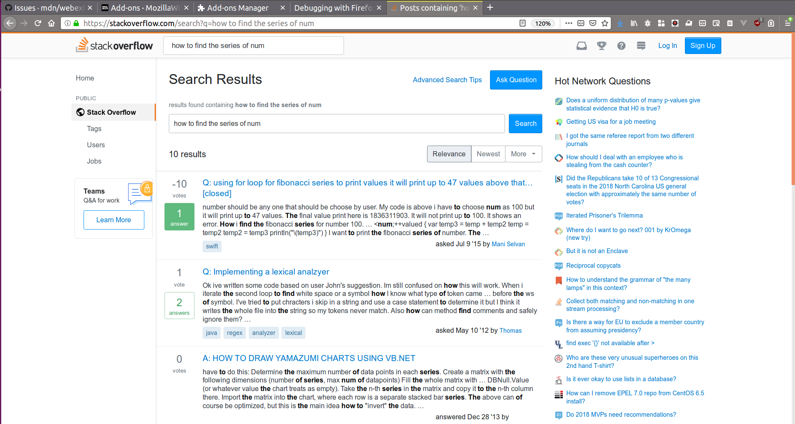

# Experiment 7: Building Quick Stackoverflow searcher

## Problem Statement and Solution

*Problem Statement*

You know very well the number of times you have been to StackOverflow for searching throughout this day. Won't it be great to have a quick searcher for the StackOverflow? In this experiment, we will be building a simple Extension where we can type the shortcut in the newtab and the text to be searched so we will be directly taken to the search page.

*Solution*

One of the solutions we can see which is similar to both chrome and Firefox is below.

Step 1: Visit https://stackoverflow.com/search?q=
Step 2: Bookmark this page.
Step 3: Edit the property of the bookmark.
Step 4: Give the shortcut (Keyword) for this bookmark in the bookmark manager.

Another solution using WebExtension, which is more similar to the mentioned above. We can do a lot of things using this. We will be defining the keyword first, and in the newtab when we are giving the keyword space the search string and hit enter we will be going to StackOverflow search page. Using WebExtension we are just replicating the above-mentioned steps.

**How we can capture this**

The address bar in the browser is called as Omnibox. In WebExtension's we are having specific API to handle the Omnibox. With this we can capture the letters being typed after our specified keyword, we can provide a suggestion as we start typing. 

Note: The very important thing we should note here is the keyword, when the same keyword is used by another WebExtension then the extension which is installed at last will be taking over the control.

## Building Blocks of Our Quick Stackoverflow searcher

### Define the Keyword

Our first step is to define the right keyword. Our **keyword** should be very unique and so it won't be used by other or taken by other WebExtensions. Our keyword is defined in the manifest.json

```javascript
  "omnibox": {
    "keyword": "sof"
  }
```

### Adding Listener to our keyword

Once we type our keyword of the extension and space the characters what we are typing will be searching string. We can capture this (but it's not mandatory) and can show the default search suggestion.

```javascript
  browser.omnibox.onInputChanged.addListener(text_typed);

  function text_typed(typed_text, suggest){
   // Do something
  }
```

So the listener callback will be giving two arguments, first is the text which is being typed and second is the suggest callback method.

### Adding Listener when text is entered

This listener is mandatory for this extension. When the user types the string and then hits enter we need to take the control and do the action we have defined. So **omnibox.onInputEntered** is mandatory for this type of extension. All the post action is done here. The listener call back method will have two arguments first is the entered string and second is disposition object.

```javascript
browser.omnibox.onInputEntered.addListener(text_entered);

function text_entered(entered_text, disposition) {
    // Do something
}
```

## Assembling our Power Search Extension Parts

### manifest.json file

In our manifest.json file we are making almost everything as usual, the additional thing we have added is for giving the keyword for this extension.

```javascript
{
  "name": "Search in Stackoverflow",
  "description": "Shortcut to search quickly in StackOverFlow",
  "version": "1.0",
  "applications": {
      "gecko": {
          "strict_min_version": "52.0a1"
      }
  },
  "omnibox": {
      "keyword": "sof"
  },
  "background": {
      "scripts": ["background.js"]
  },
  "permissions": [
      "tabs"
  ],
  "manifest_version": 2
}
```

We have already discussed about the **omnibox** JSON, here is where we will be defining the keyword for this extension, and this is the most important part. The only part which will look different to you should be the below code, which sets the value of **strict_min_version**

```javascript
"applications": {
      "gecko": {
          "strict_min_version": "52.0a1"
      }
  }
```

The meaning of above code is this extension will work only if the browser is having the version greater than  *52.0a1*, this is very important. Some of the API's are introduced very late (after 57) or will be upcoming API's. We should make sure the user who is going to install our extension is having minimum the browser version from which our API is supported; so we can avoid the breakage in extension usage. Similarly, we are also having **strict_max_version** which will say the maximum version this extension will work. Generally, there was no much need for setting *strict_max_version* but we have to be careful when the major version of the browser is released.

### Our Background Script File

Our Simple **background.js** file is shared below

```javascript
browser.omnibox.onInputChanged.addListener(text_typed);

browser.omnibox.onInputEntered.addListener(text_entered);

function text_entered(entered_text, disposition) {
    var url = 'https://stackoverflow.com/search?q=';
    url += entered_text;

    browser.tabs.update({
        url: url
    });

}

function text_typed(typed_text, suggest){
  browser.omnibox.setDefaultSuggestion({
    description: 'Searching '+typed_text+' in stackoverflow'
  });
}
```

So our first task is to listen whether our keyword is typed or not. If our keyword is typed then Firefox will activate our background script file (**background.js**). Then we will be listening to the input given by the users. Once the user starts giving the input we will be listening at **onInputChanged.addListener** and we will be passing the control to **text_typed** method, there we will be showing the list of suggestions.


Up next, the user will be finishing his/her typing and hits the enter. We will be listening to the end of the input given using the listener **onInputEntered.addListener** and we will be passing the control to **text_entered** method. In this method, we will be getting the **entered_text** variable. We simply have to append the URL and update the tab with new URL.



From the response page we can checkout the various solutions and find the best one for us.

## Exercise

To learn More about below list of API, visit MDN link given below.

- `omnibox API` [1]
- `Tab Update API` [2]
- `SuggestResult API` [3]

Try to build your custom search engine, think of giving the generic keyword for activating Omnibox and then some text to search in some search engine, then finally search text. So with some combination of shortcuts, we can search in any search engine quickly. This exercise is slightly similar to the exercise what we had in our second experiment **Building our Power Search Add-on**, so its very easy and quick one.

Optional: It will be great if you can share your code or blog about this learning on Twitter. Make sure you use hashtag #WebExtLearn when you are tweeting about this activity.

## References

- [1] https://mzl.la/2PSO2dF
- [2] https://mzl.la/2Q2qYZM
- [3] https://mzl.la/2K4HpQ3
